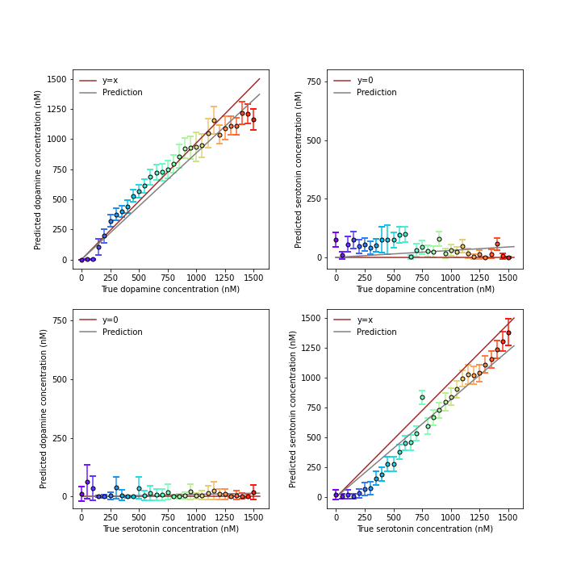

# Lasso Regression Model for Fast-scan Cyclic Voltammetry

## Overview of FSCV
Fast-scan cyclic voltammetry (FSCV) has been used to estimate the concentrations of neurotransmitters, such as dopamine (DA) and serotonin (5-HT), with high sensitivity and specificity. During the  oxidation and reduction process, the chemical of interest generates current at specific voltages whose amplitude is positively correlated to the chemical's concentration. In this project, we manufactured carbon-fiber based microelectrodes (CFEs) to capture the concentrations of DA and 5-HT in the PBS. Our goal was to generate a robust computational model that can recover the true concentrations from electrochemical recordings.

## Development of the LFSCV model
Traditionally, the FCSV model is processed using a principal component regression (PCR) [1], which combines principal component analysis and least-square regression. However, this method does not consider the drifting nature of the FSCV recordings. The principal components identified in the beginning of a session may not accurately reflect the true concentrations in the late phase of a session. Also, this method is preprocessed with background subtraction. However, there is no strict definition of a background, leaving this method rather arbitrary [2]. Here, we present a non-background-subtracted model that is based on Lasso regression, **LFSCV**. This method treats the recording samples at different voltages as independent variables. By using a regularized elastic-net regression, the model (1) identifies variables that are less drifting, (2) penalizes variables that are highly correlated, and (3) is free from arbitrary background subtractions.

## Main results
We collects 10 sessions of recordings in different DA concentrations ranging from 0-1500 nM in PBS, and 7 sessions in 0-1500 nM of 5-HT, and 8 sessions of PBS with different pH values. A model can be trained and fine-tuned in the `Lasso-Analysis.py` file. Example model performance is stored in the `Data` folder. From the figure below, we can see that the DA model accurately capture the DA concentrations and is not confused with the 5-HT and vice versa.

## Reference
[1] Fast Scan Cyclic Voltammetry: Chemical Sensing in the Brain and Beyond. Roberts, 2017 Anal Chem
[2] Failure of Standard Training Sets in the Analysis of Fast-Scan Cyclic Voltammetry Data. Johnson, 2016 ACS Chemical Neuroscience
